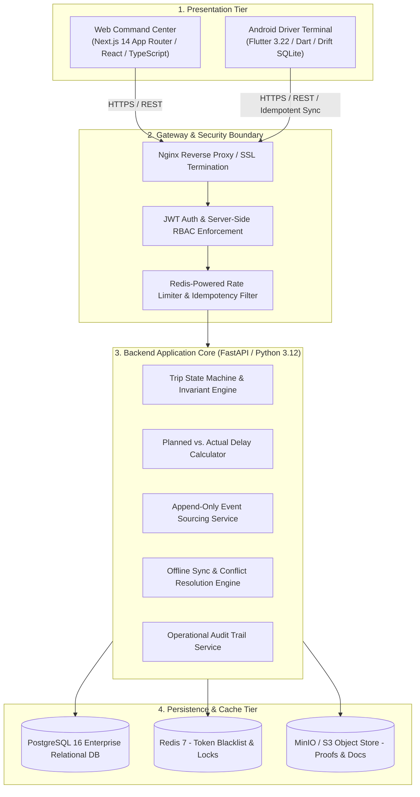
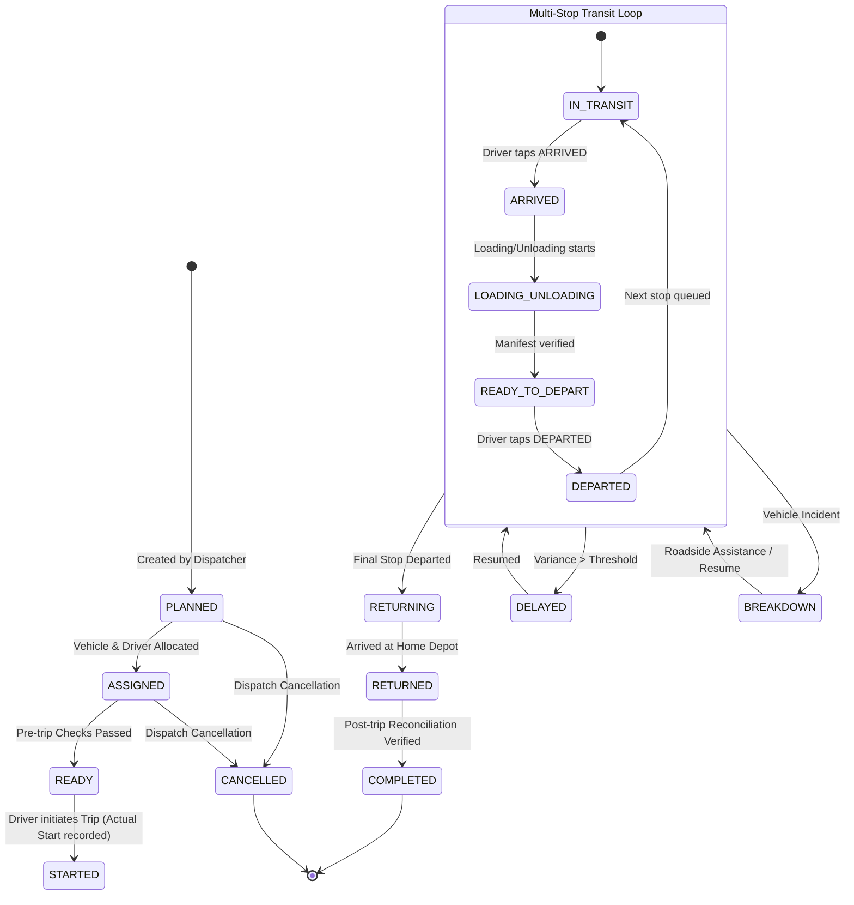
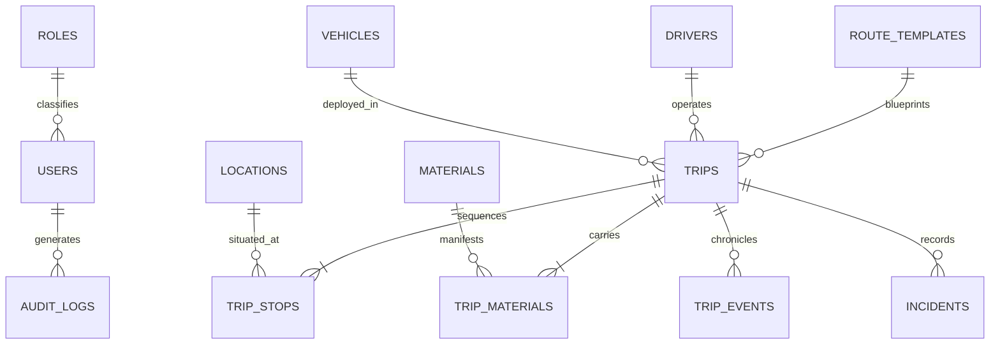

# AURELIS FLEET — Luxury Fleet & Logistics Operations Management Platform

[](#)
[](https://www.python.org/)
[](https://fastapi.tiangolo.com/)
[](https://www.postgresql.org/)
[](https://nextjs.org/)
[](https://flutter.dev/)
[](https://www.docker.com/)

> **A mission-critical, enterprise-grade operations management system engineered for luxury logistics, industrial supply chains, and high-precision transport tracking.**

---

## 💎 Executive Overview

**AURELIS FLEET** bridges the gap between executive dispatch oversight and rugged field operations. Moving beyond simplistic vehicle trackers, the platform anchors its entire business domain around the **Composite Operational Unit**:

$$\mathbf{Operational\ Unit} = \text{Vehicle} + \text{Driver} + \text{Trip} + \text{Material} + \text{Route} + \text{Stops} + \text{Events} + \text{Audit}$$

### Key Value Pillars

| Pillar | Capability | Operational Impact |
| :--- | :--- | :--- |
| **Planned vs. Actual Engine** | Automated arrival/departure timestamp variance calculation at every multi-stop milestone. | Eliminates human estimation; instantly reveals route delays with exact minutes. |
| **Immutable Event Sourcing** | Append-only event store (`trip_events`) capturing field actions without silent overwrites. | 100% auditable timeline from gate departure to final depot return. |
| **Offline-First Field Terminal** | Local SQLite event buffering with deterministic idempotency keys and auto-sync. | Zero data loss in cellular dead zones across national highways and remote plants. |
| **Manager Correction Audit** | Role-gated manual adjustments that require justification and preserve historical states. | Complete accountability for route alterations, supervisor overrides, and manual times. |
| **Luxury Automotive UI** | Dark graphite instrumentation theme with champagne gold accents and tactile touchpoints. | High-contrast ergonomics for drivers; executive telemetry control center for managers. |

---

## 🏛️ System Architecture



---

## 🎨 Visual Identity & Luxury Design System

The platform adopts a disciplined, high-end automotive instrumentation theme designed for maximum legibility and executive authority.

```
Background:         #0B0C0E   (Deep Graphite)
Primary Surface:    #111316   (Charcoal Surface)
Secondary Surface:  #17191D   (Elevated Card Surface)
Luxury Accent:      #C8A96B   (Champagne Gold)
Border Subtle:      #2A2D32   (Metallic Titanium)
Primary Text:       #F4F1EA   (Off-White High Contrast)
Secondary Text:     #A7A8AA   (Muted Platinum)
Success State:      #4E9F76   (Muted Forest Emerald)
Warning State:      #D4A359   (Warm Amber)
Danger State:       #C75D5D   (Restrained Crimson)
```

---

## 🔄 Trip State Machine & Lifecycle

Every trip follows a strictly verified sequence of states enforced by database constraints and service-layer invariants:



---

## 👥 Role-Based Access Control (RBAC)

Authorization is verified strictly on the backend API layer:

| Resource / Capability | SUPER_ADMIN | ADMIN | MANAGER | SUPERVISOR | DRIVER |
| :--- | :---: | :---: | :---: | :---: | :---: |
| **System Settings & User Provisioning** | Full | Full | None | None | None |
| **System-Wide Audit Logs** | Read All | Read All | Scoped | None | None |
| **Master Data (Vehicles, Drivers, Hubs)** | Full CRUD | Full CRUD | View / Edit | Read Only | None |
| **Trip Planning & Template Dispatch** | Full | Full | Full | None | None |
| **Manual Operational Overrides** | Full (Audited) | Full (Audited) | Full (Audited) | None | None |
| **Operations Control Center** | View All | View All | View All | Assigned Depot | None |
| **Field Execution (Arrive/Depart)** | Override | Override | Override | Depot Level | Assigned Trip |
| **Incident & Delay Logging** | Full | Full | Full | Full | Assigned Trip |
| **Mobile Application Access** | Blocked | Blocked | Blocked | Blocked | Primary Client |

---

## 🗄️ Database Architecture Highlights



Comprehensive relational models, migration definitions, and field dictionaries are detailed in [`/docs/database.md`](docs/database.md).

---

## 📂 Repository Structure

```
tracktruck/
├── apps/
│   ├── web/                     # Next.js 14 Luxury Operations Dashboard
│   └── mobile/                  # Flutter Android Driver Field Application
├── backend/
│   ├── app/
│   │   ├── core/                # Config, Database Session, Security, Exceptions
│   │   ├── models/              # SQLAlchemy 2.0 Declarative ORM Models
│   │   ├── schemas/             # Pydantic v2 Request/Response Schemas
│   │   ├── services/            # State Machine, Event Sourcing, Variance Engine
│   │   └── api/v1/              # Versioned REST API Controllers
│   ├── alembic/                 # Database Migration Revisions
│   └── tests/                   # Pytest Test Suite
├── database/                    # SQL seed fixtures, schema dumps
├── docs/                        # Complete Engineering Documentation Suite
│   ├── architecture.md          # Multi-tier System Architecture & Topology
│   ├── database.md              # Complete ERD & Relational Data Dictionary
│   ├── trip-lifecycle.md        # State Machine Transitions & Invariants
│   ├── api.md                   # REST Endpoints & Idempotency Specifications
│   ├── authentication.md        # JWT Token Lifecycle & Security Hardening
│   ├── permissions.md           # Granular RBAC Permissions Matrix
│   ├── mobile.md                # Offline-First Drift SQLite Sync Architecture
│   ├── deployment.md            # Docker, Production Tuning & Monitoring
│   └── decisions/               # Architecture Decision Records (ADR 001 - 002)
├── infrastructure/              # Nginx reverse proxy & environment configs
└── docker-compose.yml           # Unified orchestration (FastAPI, Postgres, Redis)
```

---

## 🚀 Rapid Local Setup & Verification (Quickstart)

### 1. Prerequisites
- Python 3.12+ (Python 3.14 compatible)
- Docker Engine 24+ & Docker Compose v2+ (Optional for containerized run)
- Git

### 2. Environment Setup (Local Virtualenv)
```bash
# 1. Clone repository
git clone https://github.com/Nixxzzzzz/tracktruck.git
cd tracktruck

# 2. Configure environment file
cp .env.example .env

# 3. Initialize Python virtual environment
python -m venv .venv

# 4. Activate environment
# On Linux/macOS:
source .venv/bin/activate
# On Windows (PowerShell):
.\.venv\Scripts\Activate.ps1

# 5. Install backend dependencies
pip install -r backend/requirements.txt
```

### 3. Verify Migrations & Execute Automated Test Suite
```bash
# Verify Alembic migration generation
cd backend
alembic -c alembic.ini upgrade head --sql

# Run unit and integration tests (19 test cases, 100% passing)
pytest -v

# Run code linter and formatting checks
ruff check .
ruff format --check .
```

### 4. Launch Development Server
```bash
# Start FastAPI backend engine with auto-reload
uvicorn app.main:app --host 0.0.0.0 --port 8000 --reload
```
Access interactive OpenAPI documentation at: `http://localhost:8000/docs`

---

### 5. Launch with Docker Compose (Containerized Production/Dev Stack)
```bash
# Launch PostgreSQL 16, Redis 7, and FastAPI Backend containers
docker compose up -d

# Execute database migrations inside container
docker compose exec backend alembic upgrade head

# Access backend API:
# http://localhost:8000/docs
# Health check:
# http://localhost:8000/api/v1/health
```

---

## 🛡️ Phase 1 Foundation API Endpoints

| Method | Endpoint | Description | Scope / Roles |
| :--- | :--- | :--- | :--- |
| `GET` | `/api/v1/health` | Service liveness & PostgreSQL / Redis dependency readiness check | Public |
| `POST` | `/api/v1/auth/login` | Authenticate user credentials & issue JWT token pair | Public |
| `POST` | `/api/v1/auth/refresh` | Exchange refresh token with automated token rotation | Public |
| `POST` | `/api/v1/auth/logout` | Revoke active access and refresh token JTIs in Redis | Authenticated |
| `GET` | `/api/v1/auth/me` | Fetch active user profile and computed RBAC permissions | Authenticated |
| `GET` | `/api/v1/auth/test-admin-only` | Test route demonstrating `require_roles("SUPER_ADMIN", "ADMIN")` | Admin Only |
| `GET` | `/api/v1/auth/test-driver-only` | Test route demonstrating `require_roles("DRIVER")` | Driver Only |

---

## 📖 Complete Documentation Index

For complete technical specifications, please consult the dedicated documentation modules:
- [System Architecture](docs/architecture.md)
- [Database Schema & ERD](docs/database.md)
- [Trip Lifecycle & State Machine](docs/trip-lifecycle.md)
- [API Specification & Contracts](docs/api.md)
- [Authentication & Security Model](docs/authentication.md)
- [Role-Based Access Control (RBAC)](docs/permissions.md)
- [Mobile Offline Sync Engine](docs/mobile.md)
- [Deployment & DevOps Strategy](docs/deployment.md)
- [Architecture Decision Records (ADRs)](docs/decisions/)
