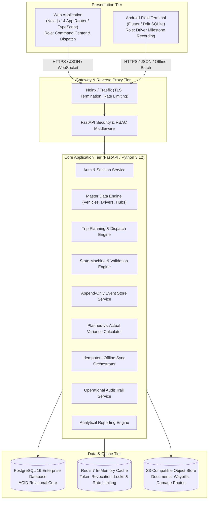
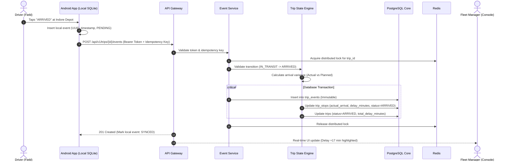

# System Architecture Specification

## 1. System Overview

AURELIS FLEET is designed as a high-reliability, multi-tier distributed logistics platform. The platform decouples presentation clients from the business and data tiers, routing all traffic through a centralized, secured API gateway.

---

## 2. Tier Responsibilities & Structural Decomposition

### 2.1 Web Application Tier (`/apps/web`)
- **Technology**: Next.js 14 (App Router), React 18, TypeScript 5, Tailwind CSS.
- **Audience**: Super Admins, Operations Admins, Fleet Managers, Depot Supervisors.
- **Key Modules**:
  - `Operations Control Center`: Real-time active trip cards, live route milestones, delayed vehicle alerts.
  - `Trip Planner`: Multi-stop route sequencer, route template loader, payload manifest assignment.
  - `Trip Detail`: Granular timeline visualizer, planned vs. actual variance matrix, incident logs, manager audit panel.
  - `Master Registries`: Vehicles, drivers, materials, locations, and route templates.
  - `Reports & Analytics`: Utilization curves, delay Pareto analysis, driver punctuality ratings.
- **Design Philosophy**: Luxury automotive dark mode (`#0B0C0E` background, `#C8A96B` champagne gold accents, typography inspired by luxury instrumentation).

### 2.2 Mobile Field Terminal Tier (`/apps/mobile`)
- **Technology**: Flutter 3.22+, Dart 3.4+, Drift (SQLite local storage).
- **Audience**: Commercial Fleet Drivers.
- **Key Capabilities**:
  - Tactile, oversized touch targets for rapid single-tap milestone reporting (`ARRIVED`, `START LOADING`, `DEPARTED`).
  - Strict offline-first architecture with persistent local queuing.
  - Zero cognitive friction: driver is presented only with current leg actions and emergency incident reporting.

### 2.3 Application Core & Service Tier (`/backend`)
- **Technology**: FastAPI (Python 3.12), Pydantic v2, SQLAlchemy 2.0, Alembic.
- **Architectural Rules**:
  - **Zero Business Logic in HTTP Controllers**: Routes are pure thin translation layers; all business rules, state validations, and transactions live in `/app/services/`.
  - **Append-Only Event Sourcing Pattern**: Operational state updates produce immutable event rows in `trip_events`.
  - **Transaction Boundary**: Trip lifecycle mutations execute in explicit PostgreSQL transactions with rollback safety.

### 2.4 Persistence & Cache Tier
- **PostgreSQL 16**: Primary source of truth with strict foreign keys, composite indexes, and check constraints.
- **Redis 7**: Distributed rate limiting, active token tracking, and distributed locks for state transition synchronization.
- **MinIO / AWS S3**: Object store for bill of lading (BOL), vehicle fitness certificates, and driver license photos.

---

## 3. Data Flow Architecture: End-to-End Operational Lifecycle

The diagram below illustrates how an operational milestone recorded in the field flows into the database, updates current state, and is reflected on executive dashboards:

---

## 4. Planned vs. Actual Calculation Specifications

To eliminate manual delay computations, the system computes five distinct variance metrics:

| Metric | Formula | Trigger Condition |
| :--- | :--- | :--- |
| **Stop Arrival Delay** | $\max(0, T_{\text{actual\_arrival}} - T_{\text{planned\_arrival}})$ | Executed upon `ARRIVED_AT_STOP` event. |
| **Stop Departure Delay** | $\max(0, T_{\text{actual\_departure}} - T_{\text{planned\_departure}})$ | Executed upon `DEPARTED_STOP` event. |
| **Stop Work Duration** | $T_{\text{actual\_departure}} - T_{\text{actual\_arrival}}$ | Calculated when departure is recorded. |
| **Leg Transit Delay** | $(T_{\text{actual\_arrival}}^{(N)} - T_{\text{actual\_departure}}^{(N-1)}) - (T_{\text{planned\_arrival}}^{(N)} - T_{\text{planned\_departure}}^{(N-1)})$ | Calculated between consecutive stops. |
| **Cumulative Trip Delay**| $\sum_{i=1}^{M} \text{StopDelay}_i + \sum_{j=1}^{M-1} \text{TransitDelay}_j$ | Recomputed dynamically on each event. |

---

## 5. Security & Isolation Model

1. **Defense in Depth**: Zero trust between tiers. All API requests require signed asymmetric JWT tokens.
2. **Data Sanitization**: Pydantic v2 enforces strict input validation against SQL injection, XSS payloads, and malformed timestamps.
3. **Audit Trail**: Any update executed by a user with role `MANAGER` or `ADMIN` that modifies operational timestamps requires a mandatory `reason` string and writes to `audit_logs`.
