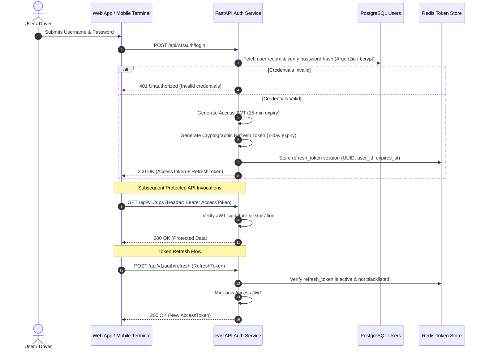

# Authentication & Security Architecture

## 1. Authentication Lifecycle

AURELIS FLEET employs an asymmetric, token-based authentication system backed by Redis for immediate revocation capabilities:



---

## 2. Token Standards & Payload Specification

### 2.1 Access Token (JWT)
- **Algorithm**: `HS256` (HMAC with SHA-256) or `RS256` (Asymmetric Private/Public keypair).
- **Time to Live (TTL)**: 15 minutes.
- **Payload Structure**:
```json
{
  "sub": "9b1deb4d-3b7d-4bad-9bdd-2b0d7b3dcb6d",
  "username": "ramesh.kumar",
  "role": "DRIVER",
  "full_name": "Ramesh Kumar",
  "driver_id": "d2e8b1c4-1a5b-4f3c-89e0-93ec482b8e02",
  "iat": 1788892800,
  "exp": 1788893700,
  "iss": "aurelis-fleet-auth"
}
```

### 2.2 Refresh Token
- **Format**: Cryptographically secure 64-character URL-safe string.
- **Storage**: Hashed (SHA-256) in Redis under key `auth:refresh:{token_hash}` with TTL matching remaining validity.

---

## 3. Password Security & Storage

- **Algorithm**: `bcrypt` (12 rounds) or `Argon2id` (RFC 9106 recommended parameters: `m=65536, t=3, p=4`).
- **Policy**:
  - Minimum 10 characters.
  - Mandatory mixed case, numerical, and symbol components.
  - Zero plaintext password persistence across logs or traces.

---

## 4. Rate Limiting & Denial-of-Service Shield

Rate limiting is enforced at the gateway layer utilizing Redis sliding window counters:

| Target Route / Scope | Threshold | Window | Action on Exceeded |
| :--- | :--- | :--- | :--- |
| `/api/v1/auth/login` | 5 attempts | 1 minute | 429 Too Many Requests + 15 min lock on IP |
| `/api/v1/trips/events/sync` | 60 requests | 1 minute | 429 Too Many Requests |
| General REST API | 300 requests | 1 minute | 429 Rate Limit Exceeded |

---

## 5. Security Headers & TLS Transport Hardening

All production responses emit strict enterprise transport security headers:
- `Strict-Transport-Security: max-age=63072000; includeSubDomains; preload`
- `X-Content-Type-Options: nosniff`
- `X-Frame-Options: DENY`
- `Content-Security-Policy: default-src 'self'; script-src 'self';`
- `Referrer-Policy: strict-origin-when-cross-origin`
