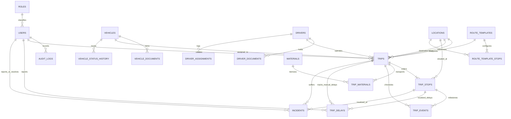

# Database Architecture & Relational Schema (Validated & Enhanced)

## 1. Relational Entity-Relationship Diagram (ERD)



---

## 2. Core Entities & Data Dictionary

### 2.1 Identity & Authorization

#### `roles`
Stores application roles for RBAC.
| Field | Type | Constraints | Description |
| :--- | :--- | :--- | :--- |
| `role_id` | VARCHAR(32) | PK | Unique role name (`SUPER_ADMIN`, `ADMIN`, `MANAGER`, `SUPERVISOR`, `DRIVER`). |
| `description` | TEXT | NOT NULL | Human-readable scope explanation. |
| `created_at` | TIMESTAMPTZ | NOT NULL, DEFAULT NOW() | Record creation timestamp. |

#### `users`
System user accounts.
| Field | Type | Constraints | Description |
| :--- | :--- | :--- | :--- |
| `user_id` | UUID | PK, DEFAULT gen_random_uuid() | Unique identifier. |
| `role_id` | VARCHAR(32) | FK -> `roles.role_id` | Assigned security role. |
| `username` | VARCHAR(64) | UNIQUE, NOT NULL | Login handle. |
| `email` | VARCHAR(255) | UNIQUE, NOT NULL | Communication & notification email. |
| `password_hash`| VARCHAR(255) | NOT NULL | Argon2id / bcrypt password hash. |
| `full_name` | VARCHAR(128) | NOT NULL | Full personal name. |
| `phone_number` | VARCHAR(32) | NULL | Contact phone. |
| `is_active` | BOOLEAN | NOT NULL, DEFAULT TRUE | Account state toggle. |
| `is_deleted` | BOOLEAN | NOT NULL, DEFAULT FALSE | Soft delete flag preserving audit history. |
| `deleted_at` | TIMESTAMPTZ | NULL | Timestamp of deactivation/soft delete. |
| `created_at` | TIMESTAMPTZ | NOT NULL, DEFAULT NOW() | Timestamp of creation. |
| `updated_at` | TIMESTAMPTZ | NOT NULL, DEFAULT NOW() | Timestamp of update. |

---

### 2.2 Master Data Registries (with Soft-Delete Protection)

> **Soft-Delete Rule**: Master data (Vehicles, Drivers, Locations, Materials) are NEVER physically deleted from the database. When an item is retired, `is_deleted` is set to `TRUE`. This ensures that all historical trips, logs, and reporting queries retain 100% referential integrity and complete readability.

#### `vehicles`
Fleet vehicle assets. Supports COMPANY, PERSONAL, and CONTRACT vehicles on the exact same trip engine.
| Field | Type | Constraints | Description |
| :--- | :--- | :--- | :--- |
| `vehicle_id` | UUID | PK, DEFAULT gen_random_uuid() | Unique identifier. |
| `registration_number` | VARCHAR(32) | UNIQUE, NOT NULL | Plate/Registration (e.g., `MP04AB1234`). |
| `vehicle_type` | VARCHAR(32) | NOT NULL | `TRUCK`, `TRAILER`, `TANKER`, `VAN`, `CONTAINER`. |
| `vehicle_category` | VARCHAR(32) | NOT NULL | `HEAVY`, `MEDIUM`, `LIGHT`. |
| `ownership_type` | VARCHAR(32) | NOT NULL | `COMPANY`, `PERSONAL`, `CONTRACT`. |
| `capacity` | NUMERIC(10,2) | NOT NULL | Max payload capacity. |
| `capacity_unit` | VARCHAR(16) | NOT NULL | `TONS`, `KG`, `LITERS`, `BAGS`. |
| `fuel_type` | VARCHAR(32) | NOT NULL | `DIESEL`, `PETROL`, `CNG`, `ELECTRIC`. |
| `manufacturer` | VARCHAR(64) | NOT NULL | Make (e.g., BharatBenz, Tata Motors). |
| `model` | VARCHAR(64) | NOT NULL | Model identifier. |
| `manufacturing_year`| INT | NOT NULL | Year of manufacture. |
| `current_status` | VARCHAR(32) | NOT NULL, DEFAULT 'AVAILABLE' | `AVAILABLE`, `ON_TRIP`, `MAINTENANCE`, `INACTIVE`. |
| `active` | BOOLEAN | NOT NULL, DEFAULT TRUE | Master registry toggle. |
| `is_deleted` | BOOLEAN | NOT NULL, DEFAULT FALSE | Soft delete flag. |
| `deleted_at` | TIMESTAMPTZ | NULL | Timestamp when archived. |
| `notes` | TEXT | NULL | Administrative remarks. |
| `created_at` | TIMESTAMPTZ | NOT NULL, DEFAULT NOW() | Created timestamp. |
| `updated_at` | TIMESTAMPTZ | NOT NULL, DEFAULT NOW() | Updated timestamp. |

#### `drivers`
Commercial transport operators. Decoupled from vehicles (can operate any authorized vehicle).
| Field | Type | Constraints | Description |
| :--- | :--- | :--- | :--- |
| `driver_id` | UUID | PK, DEFAULT gen_random_uuid() | Unique identifier. |
| `user_id` | UUID | UNIQUE, FK -> `users.user_id` | Linked login account for mobile app. |
| `name` | VARCHAR(128) | NOT NULL | Driver's official name. |
| `mobile_number` | VARCHAR(32) | UNIQUE, NOT NULL | Contact & SMS dispatch number. |
| `license_number` | VARCHAR(64) | UNIQUE, NOT NULL | Commercial driving license ID. |
| `license_type` | VARCHAR(32) | NOT NULL | `HMV`, `LMV`, `HAZMAT`. |
| `license_expiry` | DATE | NOT NULL | Driver license validity date. |
| `status` | VARCHAR(32) | NOT NULL, DEFAULT 'AVAILABLE' | `AVAILABLE`, `ON_TRIP`, `ON_LEAVE`, `SUSPENDED`. |
| `emergency_contact` | VARCHAR(64) | NULL | Emergency relation phone. |
| `active` | BOOLEAN | NOT NULL, DEFAULT TRUE | Active toggle. |
| `is_deleted` | BOOLEAN | NOT NULL, DEFAULT FALSE | Soft delete flag. |
| `deleted_at` | TIMESTAMPTZ | NULL | Timestamp when archived. |
| `notes` | TEXT | NULL | Driver performance remarks. |
| `created_at` | TIMESTAMPTZ | NOT NULL, DEFAULT NOW() | Created timestamp. |
| `updated_at` | TIMESTAMPTZ | NOT NULL, DEFAULT NOW() | Updated timestamp. |

#### `locations`
Standardized operational nodes (plants, depots, warehouses, customers). Unlimited reusable stops.
| Field | Type | Constraints | Description |
| :--- | :--- | :--- | :--- |
| `location_id` | UUID | PK, DEFAULT gen_random_uuid() | Unique identifier. |
| `name` | VARCHAR(128) | NOT NULL | Facility name (e.g., `Indore Central Depot`). |
| `location_type` | VARCHAR(32) | NOT NULL | `WAREHOUSE`, `PLANT`, `DEPOT`, `CUSTOMER`, `PORT`, `STORE`, `OTHER`. |
| `address` | TEXT | NOT NULL | Street address. |
| `city` | VARCHAR(64) | NOT NULL | City. |
| `state` | VARCHAR(64) | NOT NULL | State / Province. |
| `country` | VARCHAR(64) | NOT NULL, DEFAULT 'India' | Country. |
| `latitude` | NUMERIC(10,7)| NULL | GPS coordinate. |
| `longitude` | NUMERIC(10,7)| NULL | GPS coordinate. |
| `contact_person` | VARCHAR(128)| NULL | Site gate supervisor name. |
| `contact_number` | VARCHAR(32) | NULL | Site phone number. |
| `active` | BOOLEAN | NOT NULL, DEFAULT TRUE | Active toggle. |
| `is_deleted` | BOOLEAN | NOT NULL, DEFAULT FALSE | Soft delete flag. |
| `deleted_at` | TIMESTAMPTZ | NULL | Timestamp when archived. |
| `created_at` | TIMESTAMPTZ | NOT NULL, DEFAULT NOW() | Created timestamp. |
| `updated_at` | TIMESTAMPTZ | NOT NULL, DEFAULT NOW() | Updated timestamp. |

#### `materials`
Cargo and goods catalogue.
| Field | Type | Constraints | Description |
| :--- | :--- | :--- | :--- |
| `material_id` | UUID | PK, DEFAULT gen_random_uuid() | Unique identifier. |
| `material_code` | VARCHAR(32) | UNIQUE, NOT NULL | SKU / Code (e.g., `MAT-CEM-50`). |
| `material_name` | VARCHAR(128) | NOT NULL | Description (e.g., `Portland Pozzolana Cement`). |
| `category` | VARCHAR(64) | NOT NULL | Category (e.g., `Building Materials`). |
| `unit` | VARCHAR(16) | NOT NULL | Measurement unit (`BAGS`, `TONS`, `DRUMS`). |
| `default_weight` | NUMERIC(10,2)| NULL | Standard weight per unit (kg). |
| `active` | BOOLEAN | NOT NULL, DEFAULT TRUE | Active toggle. |
| `is_deleted` | BOOLEAN | NOT NULL, DEFAULT FALSE | Soft delete flag. |
| `deleted_at` | TIMESTAMPTZ | NULL | Timestamp when archived. |
| `created_at` | TIMESTAMPTZ | NOT NULL, DEFAULT NOW() | Created timestamp. |
| `updated_at` | TIMESTAMPTZ | NOT NULL, DEFAULT NOW() | Updated timestamp. |

---

### 2.3 Operational Entities: Trips, Multi-Stops & Materials

#### `trips`
Central operational ledger record. Supports arbitrary stops, returns, planned vs actual times.
| Field | Type | Constraints | Description |
| :--- | :--- | :--- | :--- |
| `trip_id` | UUID | PK, DEFAULT gen_random_uuid() | Unique identifier. |
| `trip_number` | VARCHAR(64) | UNIQUE, NOT NULL | Code (`TRP-YYYYMMDD-001`). |
| `trip_date` | DATE | NOT NULL | Scheduled operational date. |
| `vehicle_id` | UUID | FK -> `vehicles.vehicle_id` | Assigned fleet vehicle. |
| `driver_id` | UUID | FK -> `drivers.driver_id` | Assigned commercial driver. |
| `origin_location_id` | UUID | FK -> `locations.location_id` | Start terminal. |
| `destination_location_id`| UUID | FK -> `locations.location_id` | Final terminal. |
| `template_id` | UUID | FK -> `route_templates.template_id` (NULLABLE) | Route template if instantiated from one. |
| `status` | VARCHAR(32) | NOT NULL, DEFAULT 'PLANNED' | Current state machine status. |
| `priority` | VARCHAR(16) | NOT NULL, DEFAULT 'MEDIUM' | `LOW`, `MEDIUM`, `HIGH`, `URGENT`. |
| `trip_type` | VARCHAR(32) | NOT NULL | `ONE_WAY`, `ROUND_TRIP`, `MULTI_DROP`. |
| `planned_start_time` | TIMESTAMPTZ | NOT NULL | Scheduled dispatch time. |
| `actual_start_time` | TIMESTAMPTZ | NULL | Automatically recorded start time. |
| `planned_return_time` | TIMESTAMPTZ | NOT NULL | Scheduled return/completion time. |
| `actual_return_time` | TIMESTAMPTZ | NULL | Automatically recorded return time. |
| `planned_duration_minutes`| INT | NOT NULL DEFAULT 0 | Computed planned duration. |
| `actual_duration_minutes` | INT | NOT NULL DEFAULT 0 | Automatically computed actual duration. |
| `total_distance_km` | NUMERIC(8,2)| DEFAULT 0 | Cumulative distance. |
| `total_delay_minutes` | INT | NOT NULL, DEFAULT 0 | Automatically aggregated delay variance. |
| `current_stop_id` | UUID | NULL | Pointer to currently active stop. |
| `notes` | TEXT | NULL | Operational notes. |
| `created_by` | UUID | FK -> `users.user_id` | Dispatcher who scheduled trip. |
| `created_at` | TIMESTAMPTZ | NOT NULL, DEFAULT NOW() | Created timestamp. |
| `updated_at` | TIMESTAMPTZ | NOT NULL, DEFAULT NOW() | Updated timestamp. |

#### `trip_stops`
Unlimited ordered multi-stop sequence.
| Field | Type | Constraints | Description |
| :--- | :--- | :--- | :--- |
| `stop_id` | UUID | PK, DEFAULT gen_random_uuid() | Unique identifier. |
| `trip_id` | UUID | FK -> `trips.trip_id` ON DELETE CASCADE | Parent trip. |
| `sequence_number` | INT | NOT NULL | Stop order (1, 2, 3... N). |
| `location_id` | UUID | FK -> `locations.location_id` | Waypoint destination. |
| `planned_arrival` | TIMESTAMPTZ | NOT NULL | Scheduled arrival. |
| `actual_arrival` | TIMESTAMPTZ | NULL | Automatically recorded arrival. |
| `arrival_delay_minutes`| INT | NOT NULL, DEFAULT 0 | Automatically calculated arrival delay. |
| `planned_departure` | TIMESTAMPTZ | NOT NULL | Scheduled departure. |
| `actual_departure` | TIMESTAMPTZ | NULL | Automatically recorded departure. |
| `departure_delay_minutes`| INT | NOT NULL, DEFAULT 0 | Automatically calculated departure delay. |
| `planned_stop_duration_minutes`| INT | NOT NULL, DEFAULT 0 | Scheduled dwell time. |
| `actual_stop_duration_minutes` | INT | NOT NULL, DEFAULT 0 | Automatically calculated dwell time. |
| `status` | VARCHAR(32) | NOT NULL, DEFAULT 'PENDING' | `PENDING`, `ARRIVED`, `LOADING`, `UNLOADING`, `DEPARTED`, `SKIPPED`. |
| `loading_required` | BOOLEAN | NOT NULL, DEFAULT FALSE | Manifest loading at this stop. |
| `unloading_required`| BOOLEAN | NOT NULL, DEFAULT FALSE | Manifest unloading at this stop. |
| `notes` | TEXT | NULL | Site/stop instructions. |
| `created_at` | TIMESTAMPTZ | NOT NULL, DEFAULT NOW() | Created timestamp. |
| `updated_at` | TIMESTAMPTZ | NOT NULL, DEFAULT NOW() | Updated timestamp. |
| CONSTRAINT | UNIQUE(trip_id, sequence_number) | | Guarantees sequential integrity. |

#### `trip_materials`
Many-to-many relationship supporting multiple materials per trip, attached to specific pickup and drop stops.
| Field | Type | Constraints | Description |
| :--- | :--- | :--- | :--- |
| `trip_material_id` | UUID | PK, DEFAULT gen_random_uuid() | Unique identifier. |
| `trip_id` | UUID | FK -> `trips.trip_id` ON DELETE CASCADE | Target trip. |
| `material_id` | UUID | FK -> `materials.material_id` | Catalog material. |
| `pickup_stop_id` | UUID | FK -> `trip_stops.stop_id` (NULLABLE)| Stop where material is loaded. |
| `drop_stop_id` | UUID | FK -> `trip_stops.stop_id` (NULLABLE)| Stop where material is unloaded. |
| `quantity` | NUMERIC(10,2) | NOT NULL | Number of units. |
| `weight_tons` | NUMERIC(10,2) | NULL | Weight in metric tons. |
| `notes` | TEXT | NULL | Specific handling instructions. |
| `created_at` | TIMESTAMPTZ | NOT NULL, DEFAULT NOW() | Created timestamp. |

---

### 2.4 Delays & Incidents (Strictly Separated Concepts)

#### `trip_delays` (Manually Reported Delays)
Distinct from the automatically calculated arrival/departure variance. Represents an explicit delay event reported by a driver, supervisor, or manager with human root-cause categorization.
| Field | Type | Constraints | Description |
| :--- | :--- | :--- | :--- |
| `delay_id` | UUID | PK, DEFAULT gen_random_uuid() | Unique identifier. |
| `trip_id` | UUID | FK -> `trips.trip_id` ON DELETE CASCADE | Associated trip. |
| `stop_id` | UUID | FK -> `trip_stops.stop_id` (NULLABLE)| Associated stop (if delay occurred at a stop). |
| `delay_type` | VARCHAR(32) | NOT NULL | Categorization (see list below). |
| `delay_minutes` | INT | NOT NULL | Reported or estimated delay in minutes. |
| `reason` | TEXT | NOT NULL | Summary reason. |
| `notes` | TEXT | NULL | Additional operational context. |
| `reported_by` | UUID | FK -> `users.user_id` | User who logged the delay (driver, supervisor, manager). |
| `reported_at` | TIMESTAMPTZ | NOT NULL, DEFAULT NOW() | When delay was reported. |
| `created_at` | TIMESTAMPTZ | NOT NULL, DEFAULT NOW() | Created timestamp. |

> **Delay Categories (`delay_type`)**:
> `TRAFFIC`, `LOADING_DELAY`, `UNLOADING_DELAY`, `VEHICLE_PROBLEM`, `ROAD_BLOCK`, `WEATHER`, `DOCUMENTATION`, `CUSTOMER_DELAY`, `SUPPLIER_DELAY`, `DRIVER_RELATED`, `ROUTE_PROBLEM`, `OTHER`.

#### `incidents` (Vehicle Problems & Operational Crises)
Dedicated model for breakdowns, accidents, mechanical problems, and emergencies.
| Field | Type | Constraints | Description |
| :--- | :--- | :--- | :--- |
| `incident_id` | UUID | PK, DEFAULT gen_random_uuid() | Unique identifier. |
| `trip_id` | UUID | FK -> `trips.trip_id` ON DELETE CASCADE | Associated trip. |
| `vehicle_id` | UUID | FK -> `vehicles.vehicle_id` | Vehicle involved. |
| `driver_id` | UUID | FK -> `drivers.driver_id` | Driver on duty. |
| `stop_id` | UUID | FK -> `trip_stops.stop_id` (NULLABLE)| Associated stop if incident occurred at a stop. |
| `incident_type` | VARCHAR(32) | NOT NULL | `BREAKDOWN`, `TYRE_PUNCTURE`, `ENGINE_PROBLEM`, `ACCIDENT`, `FUEL_PROBLEM`, `ROAD_BLOCK`, `WEATHER`, `LOADING_PROBLEM`, `UNLOADING_PROBLEM`, `DOCUMENTATION_PROBLEM`, `CUSTOMER_PROBLEM`, `DRIVER_ISSUE`, `ROUTE_PROBLEM`, `OTHER`. |
| `severity` | VARCHAR(16) | NOT NULL | `LOW`, `MEDIUM`, `HIGH`, `CRITICAL`. |
| `description` | TEXT | NOT NULL | Detailed description of the event. |
| `location_name` | VARCHAR(255)| NULL | Human-readable location (e.g., `NH46 near Dewas Bypass`). |
| `latitude` | NUMERIC(10,7)| NULL | GPS coordinate if available. |
| `longitude` | NUMERIC(10,7)| NULL | GPS coordinate if available. |
| `action_taken` | TEXT | NULL | Immediate response or remedial action. |
| `delay_caused_minutes`| INT | NOT NULL, DEFAULT 0 | Estimated delay resulting from incident. |
| `resolved` | BOOLEAN | NOT NULL, DEFAULT FALSE | Resolution state flag. |
| `resolved_at` | TIMESTAMPTZ | NULL | Timestamp of resolution. |
| `resolved_by` | UUID | FK -> `users.user_id` (NULLABLE)| Manager/Supervisor who verified resolution. |
| `resolution_notes`| TEXT | NULL | Detailed notes on how the incident was resolved. |
| `reported_by` | UUID | FK -> `users.user_id` | User who logged the incident. |
| `reported_at` | TIMESTAMPTZ | NOT NULL, DEFAULT NOW() | Timestamp when incident was reported. |
| `created_at` | TIMESTAMPTZ | NOT NULL, DEFAULT NOW() | Created timestamp. |
| `updated_at` | TIMESTAMPTZ | NOT NULL, DEFAULT NOW() | Updated timestamp. |

---

### 2.5 Immutable Timeline & Auditing

#### `trip_events` (Append-Only Event Store)
Preserves every discrete operational milestone in chronological order. Never deleted or modified.
| Field | Type | Constraints | Description |
| :--- | :--- | :--- | :--- |
| `event_id` | UUID | PK, DEFAULT gen_random_uuid() | Unique identifier. |
| `trip_id` | UUID | FK -> `trips.trip_id` ON DELETE CASCADE | Associated trip. |
| `stop_id` | UUID | FK -> `trip_stops.stop_id` (NULLABLE)| Associated stop if applicable. |
| `vehicle_id` | UUID | FK -> `vehicles.vehicle_id` | Vehicle active at time of event. |
| `driver_id` | UUID | FK -> `drivers.driver_id` | Driver active at time of event. |
| `event_type` | VARCHAR(64) | NOT NULL | `TRIP_STARTED`, `ARRIVED_AT_STOP`, `LOADING_STARTED`, `LOADING_COMPLETED`, `DEPARTED_STOP`, `DELAY_REPORTED`, `INCIDENT_REPORTED`, `MANUAL_CORRECTION`, `TRIP_COMPLETED`. |
| `device_event_time`| TIMESTAMPTZ | NOT NULL | Timestamp recorded by the client device. |
| `server_received_time`| TIMESTAMPTZ | NOT NULL, DEFAULT NOW() | Trusted server timestamp upon ingestion. |
| `clock_skew_flag` | BOOLEAN | NOT NULL, DEFAULT FALSE | True if $\|device - server\| > 15 \text{ min}$. |
| `status` | VARCHAR(32) | NOT NULL | Resulting status after event application. |
| `latitude` | NUMERIC(10,7)| NULL | Location latitude. |
| `longitude` | NUMERIC(10,7)| NULL | Location longitude. |
| `notes` | TEXT | NULL | Event notes. |
| `source` | VARCHAR(32) | NOT NULL DEFAULT 'DRIVER_APP'| `DRIVER_APP`, `WEB`, `MANAGER`, `SYSTEM`. |
| `idempotency_key`| VARCHAR(128) | UNIQUE, NOT NULL | Prevents duplicate ingestion on mobile retries. |
| `created_by` | UUID | FK -> `users.user_id` | User triggering the event. |
| `created_at` | TIMESTAMPTZ | NOT NULL, DEFAULT NOW() | Server persistence timestamp. |

#### `audit_logs` (Forensic Modification Trail)
Captures every manual alteration, manager override, and administrative update.
| Field | Type | Constraints | Description |
| :--- | :--- | :--- | :--- |
| `audit_id` | UUID | PK, DEFAULT gen_random_uuid() | Unique identifier. |
| `user_id` | UUID | FK -> `users.user_id` | User who made the manual change. |
| `entity_type` | VARCHAR(64) | NOT NULL | `trips`, `trip_stops`, `vehicles`, `drivers`. |
| `entity_id` | UUID | NOT NULL | Primary key of the modified row. |
| `action` | VARCHAR(32) | NOT NULL | `MANUAL_CORRECTION`, `STATUS_OVERRIDE`, `ASSIGNMENT_CHANGE`. |
| `field_name` | VARCHAR(64) | NOT NULL | Name of the column altered. |
| `old_value` | TEXT | NULL | Previous value prior to update. |
| `new_value` | TEXT | NOT NULL | Newly committed value. |
| `reason` | TEXT | NOT NULL | Mandatory human justification for change. |
| `timestamp` | TIMESTAMPTZ | NOT NULL, DEFAULT NOW() | Authoritative server timestamp. |
| `ip_address` | VARCHAR(45) | NULL | Client IP for security auditing. |

---

## 3. High-Performance Indexing Strategy

```sql
-- Active trip querying on dashboard
CREATE INDEX idx_trips_status_date ON trips(status, trip_date);
CREATE INDEX idx_trips_vehicle_active ON trips(vehicle_id) WHERE status NOT IN ('COMPLETED', 'CANCELLED');
CREATE INDEX idx_trips_driver_active ON trips(driver_id) WHERE status NOT IN ('COMPLETED', 'CANCELLED');

-- Sequenced stop lookups
CREATE INDEX idx_trip_stops_ordered ON trip_stops(trip_id, sequence_number ASC);

-- Timeline retrieval
CREATE INDEX idx_trip_events_chronology ON trip_events(trip_id, device_event_time ASC);
CREATE INDEX idx_trip_events_idempotency ON trip_events(idempotency_key);

-- Unresolved incidents triage
CREATE INDEX idx_incidents_unresolved ON incidents(resolved, severity) WHERE resolved = FALSE;

-- Forensic audit trail lookup
CREATE INDEX idx_audit_entity_time ON audit_logs(entity_type, entity_id, timestamp DESC);

-- Soft-delete filtered indexes
CREATE INDEX idx_vehicles_active_available ON vehicles(current_status) WHERE is_deleted = FALSE AND active = TRUE;
CREATE INDEX idx_drivers_active_available ON drivers(status) WHERE is_deleted = FALSE AND active = TRUE;
```
