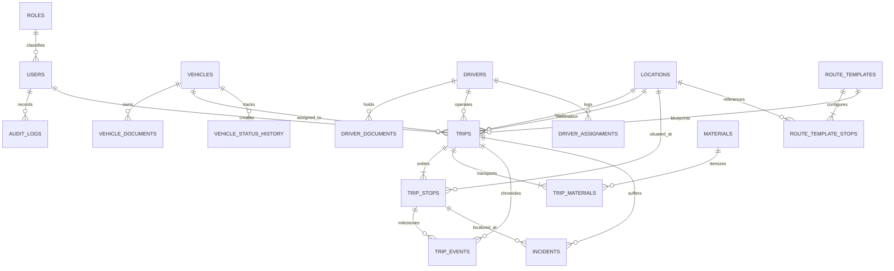

# Database Architecture & Relational Schema

## 1. Relational Entity-Relationship Diagram (ERD)



---

## 2. Core Entities & Data Dictionary

### 2.1 Identity & Authorization

#### `roles`
Stores application roles for RBAC.
| Field | Type | Constraints | Description |
| :--- | :--- | :--- | :--- |
| `role_id` | VARCHAR(32) | PK | Unique role name (`SUPER_ADMIN`, `ADMIN`, `MANAGER`, `SUPERVISOR`, `DRIVER`). |
| `description` | TEXT | NOT NULL | Human-readable scope explanation. |
| `created_at` | TIMESTAMPTZ | NOT NULL, DEFAULT NOW() | Record creation timestamp. |

#### `users`
System user accounts.
| Field | Type | Constraints | Description |
| :--- | :--- | :--- | :--- |
| `user_id` | UUID | PK, DEFAULT gen_random_uuid() | Unique identifier. |
| `role_id` | VARCHAR(32) | FK -> `roles.role_id` | Assigned security role. |
| `username` | VARCHAR(64) | UNIQUE, NOT NULL | Login handle. |
| `email` | VARCHAR(255) | UNIQUE, NOT NULL | Communication & notification email. |
| `password_hash`| VARCHAR(255) | NOT NULL | Argon2id / bcrypt password hash. |
| `full_name` | VARCHAR(128) | NOT NULL | Full personal name. |
| `phone_number` | VARCHAR(32) | NULL | Contact phone. |
| `is_active` | BOOLEAN | NOT NULL, DEFAULT TRUE | Account state toggle. |
| `created_at` | TIMESTAMPTZ | NOT NULL, DEFAULT NOW() | Timestamp of creation. |
| `updated_at` | TIMESTAMPTZ | NOT NULL, DEFAULT NOW() | Timestamp of update. |

---

### 2.2 Master Data Registries

#### `vehicles`
Fleet vehicle assets.
| Field | Type | Constraints | Description |
| :--- | :--- | :--- | :--- |
| `vehicle_id` | UUID | PK, DEFAULT gen_random_uuid() | Unique identifier. |
| `registration_number` | VARCHAR(32) | UNIQUE, NOT NULL | Plate/Registration (e.g., `MP04AB1234`). |
| `vehicle_type` | VARCHAR(32) | NOT NULL | `TRUCK`, `TRAILER`, `TANKER`, `VAN`, `CONTAINER`. |
| `vehicle_category` | VARCHAR(32) | NOT NULL | `HEAVY`, `MEDIUM`, `LIGHT`. |
| `ownership_type` | VARCHAR(32) | NOT NULL | `COMPANY`, `PERSONAL`, `CONTRACT`. |
| `capacity` | NUMERIC(10,2) | NOT NULL | Max payload capacity. |
| `capacity_unit` | VARCHAR(16) | NOT NULL | `TONS`, `KG`, `LITERS`, `BAGS`. |
| `fuel_type` | VARCHAR(32) | NOT NULL | `DIESEL`, `PETROL`, `CNG`, `ELECTRIC`. |
| `manufacturer` | VARCHAR(64) | NOT NULL | Make (e.g., BharatBenz, Tata Motors). |
| `model` | VARCHAR(64) | NOT NULL | Model identifier. |
| `manufacturing_year`| INT | NOT NULL | Year of manufacture. |
| `current_status` | VARCHAR(32) | NOT NULL, DEFAULT 'AVAILABLE' | `AVAILABLE`, `ON_TRIP`, `MAINTENANCE`, `INACTIVE`. |
| `active` | BOOLEAN | NOT NULL, DEFAULT TRUE | Master registry toggle. |
| `notes` | TEXT | NULL | Administrative remarks. |

#### `drivers`
Authorized transport operators.
| Field | Type | Constraints | Description |
| :--- | :--- | :--- | :--- |
| `driver_id` | UUID | PK, DEFAULT gen_random_uuid() | Unique identifier. |
| `user_id` | UUID | UNIQUE, FK -> `users.user_id` | Linked login account for mobile app. |
| `name` | VARCHAR(128) | NOT NULL | Driver's official name. |
| `mobile_number` | VARCHAR(32) | UNIQUE, NOT NULL | Contact & SMS dispatch number. |
| `license_number` | VARCHAR(64) | UNIQUE, NOT NULL | Commercial driving license ID. |
| `license_type` | VARCHAR(32) | NOT NULL | `HMV`, `LMV`, `HAZMAT`. |
| `license_expiry` | DATE | NOT NULL | Driver license validity date. |
| `status` | VARCHAR(32) | NOT NULL, DEFAULT 'AVAILABLE' | `AVAILABLE`, `ON_TRIP`, `ON_LEAVE`, `SUSPENDED`. |
| `emergency_contact` | VARCHAR(64) | NULL | Emergency relation phone. |
| `notes` | TEXT | NULL | Driver performance remarks. |

#### `locations`
Standardized operational nodes (plants, depots, warehouses, customers).
| Field | Type | Constraints | Description |
| :--- | :--- | :--- | :--- |
| `location_id` | UUID | PK, DEFAULT gen_random_uuid() | Unique identifier. |
| `name` | VARCHAR(128) | NOT NULL | Facility name (e.g., `Indore Central Depot`). |
| `location_type` | VARCHAR(32) | NOT NULL | `WAREHOUSE`, `PLANT`, `DEPOT`, `CUSTOMER`, `PORT`. |
| `address` | TEXT | NOT NULL | Street address. |
| `city` | VARCHAR(64) | NOT NULL | City. |
| `state` | VARCHAR(64) | NOT NULL | State / Province. |
| `country` | VARCHAR(64) | NOT NULL, DEFAULT 'India' | Country. |
| `latitude` | NUMERIC(10,7)| NULL | GPS coordinate. |
| `longitude` | NUMERIC(10,7)| NULL | GPS coordinate. |
| `contact_person` | VARCHAR(128)| NULL | Site gate supervisor name. |
| `contact_number` | VARCHAR(32) | NULL | Site phone number. |

#### `materials`
Cargo catalog.
| Field | Type | Constraints | Description |
| :--- | :--- | :--- | :--- |
| `material_id` | UUID | PK, DEFAULT gen_random_uuid() | Unique identifier. |
| `material_code` | VARCHAR(32) | UNIQUE, NOT NULL | SKU / Code (e.g., `MAT-CEM-50`). |
| `material_name` | VARCHAR(128) | NOT NULL | Description (e.g., `Portland Pozzolana Cement`). |
| `category` | VARCHAR(64) | NOT NULL | Category (e.g., `Building Materials`). |
| `unit` | VARCHAR(16) | NOT NULL | Measurement unit (`BAGS`, `TONS`, `DRUMS`). |
| `default_weight` | NUMERIC(10,2)| NULL | Standard weight per unit (kg). |

---

### 2.3 Operational Entities (Trips & Manifests)

#### `trips`
Central operational ledger record.
| Field | Type | Constraints | Description |
| :--- | :--- | :--- | :--- |
| `trip_id` | UUID | PK, DEFAULT gen_random_uuid() | Unique identifier. |
| `trip_number` | VARCHAR(64) | UNIQUE, NOT NULL | Human-readable code (`TRP-20260908-001`). |
| `trip_date` | DATE | NOT NULL | Scheduled operational date. |
| `vehicle_id` | UUID | FK -> `vehicles.vehicle_id` | Assigned fleet vehicle. |
| `driver_id` | UUID | FK -> `drivers.driver_id` | Assigned commercial driver. |
| `origin_location_id` | UUID | FK -> `locations.location_id` | Start terminal. |
| `destination_location_id`| UUID | FK -> `locations.location_id` | Final terminal. |
| `status` | VARCHAR(32) | NOT NULL, DEFAULT 'PLANNED' | Current state machine status. |
| `priority` | VARCHAR(16) | NOT NULL, DEFAULT 'MEDIUM' | `LOW`, `MEDIUM`, `HIGH`, `URGENT`. |
| `trip_type` | VARCHAR(32) | NOT NULL | `ONE_WAY`, `ROUND_TRIP`, `MULTI_DROP`. |
| `planned_start_time` | TIMESTAMPTZ | NOT NULL | Scheduled dispatch time. |
| `actual_start_time` | TIMESTAMPTZ | NULL | Recorded start time. |
| `planned_return_time` | TIMESTAMPTZ | NOT NULL | Scheduled end time. |
| `actual_return_time` | TIMESTAMPTZ | NULL | Recorded completion time. |
| `total_distance_km` | NUMERIC(8,2)| DEFAULT 0 | Cumulative distance. |
| `total_delay_minutes` | INT | NOT NULL, DEFAULT 0 | Dynamically aggregated route delay. |
| `created_by` | UUID | FK -> `users.user_id` | Dispatcher who scheduled trip. |

#### `trip_stops`
Ordered stops along the route.
| Field | Type | Constraints | Description |
| :--- | :--- | :--- | :--- |
| `stop_id` | UUID | PK, DEFAULT gen_random_uuid() | Unique identifier. |
| `trip_id` | UUID | FK -> `trips.trip_id` ON DELETE CASCADE | Parent trip. |
| `sequence_number` | INT | NOT NULL | Leg order (1, 2, 3...). |
| `location_id` | UUID | FK -> `locations.location_id` | Destination waypoint. |
| `planned_arrival` | TIMESTAMPTZ | NOT NULL | Scheduled arrival time. |
| `actual_arrival` | TIMESTAMPTZ | NULL | Recorded arrival time. |
| `planned_departure` | TIMESTAMPTZ | NOT NULL | Scheduled departure time. |
| `actual_departure` | TIMESTAMPTZ | NULL | Recorded departure time. |
| `status` | VARCHAR(32) | NOT NULL, DEFAULT 'PENDING' | `PENDING`, `ARRIVED`, `DEPARTED`, `SKIPPED`. |
| `loading_required` | BOOLEAN | NOT NULL, DEFAULT FALSE | Whether cargo is loaded here. |
| `unloading_required`| BOOLEAN | NOT NULL, DEFAULT FALSE | Whether cargo is unloaded here. |
| `delay_minutes` | INT | NOT NULL, DEFAULT 0 | Calculated stop delay. |

---

### 2.4 Immutable Event Store & Auditing

#### `trip_events`
Append-only operational timeline log.
| Field | Type | Constraints | Description |
| :--- | :--- | :--- | :--- |
| `event_id` | UUID | PK, DEFAULT gen_random_uuid() | Unique identifier. |
| `trip_id` | UUID | FK -> `trips.trip_id` | Target trip. |
| `stop_id` | UUID | FK -> `trip_stops.stop_id` (NULLABLE)| Associated stop if applicable. |
| `vehicle_id` | UUID | FK -> `vehicles.vehicle_id` | Vehicle at time of event. |
| `driver_id` | UUID | FK -> `drivers.driver_id` | Driver at time of event. |
| `event_type` | VARCHAR(64) | NOT NULL | `TRIP_STARTED`, `ARRIVED_AT_STOP`, etc. |
| `event_time` | TIMESTAMPTZ | NOT NULL | Timestamp when action happened. |
| `status` | VARCHAR(32) | NOT NULL | Status after event application. |
| `delay_minutes` | INT | DEFAULT 0 | Reported or computed delay. |
| `delay_type` | VARCHAR(32) | NULL | `TRAFFIC`, `WEATHER`, `MECHANICAL`, etc. |
| `reason` | TEXT | NULL | Human description of cause. |
| `source` | VARCHAR(32) | NOT NULL, DEFAULT 'DRIVER_APP' | `DRIVER_APP`, `WEB`, `MANAGER`, `SYSTEM`. |
| `idempotency_key` | VARCHAR(128) | UNIQUE, NOT NULL | Mobile sync deduplication token. |

#### `audit_logs`
Operational adjustments & administrative alterations.
| Field | Type | Constraints | Description |
| :--- | :--- | :--- | :--- |
| `audit_id` | UUID | PK, DEFAULT gen_random_uuid() | Unique identifier. |
| `user_id` | UUID | FK -> `users.user_id` | User performing modification. |
| `entity_type` | VARCHAR(64) | NOT NULL | Target table (`trips`, `trip_stops`, etc.). |
| `entity_id` | UUID | NOT NULL | Primary key of modified row. |
| `action` | VARCHAR(32) | NOT NULL | `CREATE`, `UPDATE`, `MANUAL_CORRECTION`. |
| `field_name` | VARCHAR(64) | NULL | Modified column. |
| `old_value` | TEXT | NULL | Value prior to adjustment. |
| `new_value` | TEXT | NULL | New committed value. |
| `reason` | TEXT | NOT NULL | Mandatory justification for change. |
| `timestamp` | TIMESTAMPTZ | NOT NULL, DEFAULT NOW() | Server time of modification. |

---

## 3. Indexing Strategy for Low-Latency Operations

```sql
-- Fast lookup for active fleet operations
CREATE INDEX idx_trips_date_status ON trips(trip_date, status);
CREATE INDEX idx_trips_active ON trips(vehicle_id, status) WHERE status NOT IN ('COMPLETED', 'CANCELLED');

-- Sequenced stop queries
CREATE INDEX idx_trip_stops_ordering ON trip_stops(trip_id, sequence_number);

-- Chronological timeline retrieval
CREATE INDEX idx_trip_events_timeline ON trip_events(trip_id, event_time ASC);

-- Rapid lookup of active incidents
CREATE INDEX idx_incidents_active ON incidents(resolved, severity) WHERE resolved = FALSE;

-- Entity audit histories
CREATE INDEX idx_audit_logs_entity ON audit_logs(entity_type, entity_id, timestamp DESC);
```
