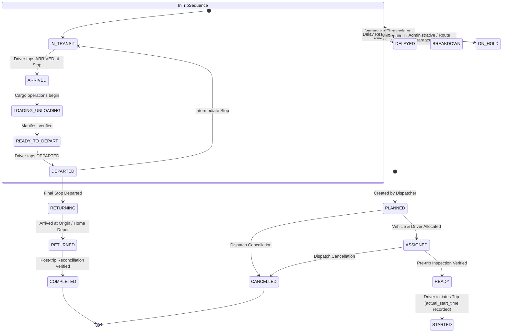

# Trip Lifecycle & State Machine Specification (Validated & Enhanced)

## 1. Operational State Hierarchy

A Trip in AURELIS FLEET transitions across three distinct layers of state:
1. **Trip Level State** (`trips.status`): Overall operational mission status.
2. **Stop Level State** (`trip_stops.status`): Progress along individual stops.
3. **Discrete Chronological Events** (`trip_events`): Append-only milestone stream.

---

## 2. Complete State Machine

---

## 3. Automatically Calculated Delays vs. Manually Reported Delays

The platform strictly differentiates between two fundamentally distinct delay concepts:

| Dimension | Automatically Calculated Delay (Variance) | Manually Reported Delay |
| :--- | :--- | :--- |
| **Origin** | Derived mathematically by the backend state machine. | Explicitly entered by human driver, supervisor, or manager. |
| **Storage** | Columns on `trip_stops` (`arrival_delay_minutes`, `departure_delay_minutes`) and `trips` (`total_delay_minutes`). | Dedicated `trip_delays` rows + logged in `trip_events`. |
| **Formula** | $\text{Arrival Delay} = \max(0, T_{\text{actual\_arrival}} - T_{\text{planned\_arrival}})$ | Human estimated impact (e.g., "45 minutes"). |
| **Context** | Exact temporal discrepancy against dispatch plan. | Qualitative categorization (`TRAFFIC`, `WEATHER`, `ROAD_BLOCK`) and descriptive notes. |
| **Purpose** | Algorithmic SLA tracking and schedule adherence. | Root-cause diagnostic analysis and operational accountability. |

---

## 4. Comprehensive Edge Case Analysis (25 Operational Scenarios)

### Scenario 1: Vehicle breaks down during a trip
- **Detection**: Driver taps `REPORT PROBLEM` -> Selects `BREAKDOWN` -> Notes "Engine overheating on highway".
- **System Behavior**:
  - `trips.status` transitions to `BREAKDOWN`.
  - Record inserted into `incidents` (`severity=HIGH`, `incident_type=BREAKDOWN`).
  - Append-only event `INCIDENT_REPORTED` written to `trip_events`.
  - Operations Control Center triggers alert badge with vehicle contact and breakdown location.
  - Vehicle status in `vehicles` updated to `MAINTENANCE`.

### Scenario 2: Driver changes vehicle (Before Departure or During Trip)
- **Workflow**:
  - Before Departure: Manager edits trip assignment (`trips.vehicle_id = new_vehicle_id`). Old vehicle reverts to `AVAILABLE`. Audit log captures reassignment.
  - During Trip (Vehicle Swap): Manager logs an authorized vehicle replacement via `POST /api/v1/trips/{id}/manual-correction`. Old vehicle marked `MAINTENANCE`; new vehicle marked `ON_TRIP`. An event `VEHICLE_SWAPPED` is appended.

### Scenario 3: Driver changes during a trip
- **Workflow**: If the initial driver falls ill or exceeds maximum shift hours, Manager assigns a relief driver.
- **System Behavior**: `trips.driver_id` is updated to the relief driver. An audited event `DRIVER_REASSIGNED` is recorded. The new driver can immediately see the active trip upon logging into their mobile app.

### Scenario 4: Trip is delayed before starting
- **Workflow**: Scheduled start was 06:00 AM, but loading at depot is delayed until 07:30 AM.
- **System Behavior**: Trip remains in `READY`. When Driver taps `START TRIP` at 07:30 AM, system records `actual_start_time = 07:30 AM` and automatically sets `trip_start_delay_minutes = 90`. Prompt asks Driver for delay reason (e.g. `LOADING_DELAY`).

### Scenario 5: Trip is cancelled after assignment
- **Workflow**: Order is cancelled by customer while trip is in `ASSIGNED` or `READY`.
- **System Behavior**: Manager executes `POST /api/v1/trips/{id}/cancel` with mandatory reason. Status becomes `CANCELLED`. Vehicle and Driver statuses immediately revert from reserved to `AVAILABLE`. Historical trip record is preserved with status `CANCELLED`.

### Scenario 6: A stop is skipped
- **Workflow**: Road block or customer refusal prevents vehicle from reaching Stop #3.
- **System Behavior**: Driver cannot unilaterally skip a stop. Manager approves skip via console or supervisor override. Stop #3 is marked `status = SKIPPED`. Sequence pointer advances to Stop #4. An event `STOP_SKIPPED` with authorized manager ID and reason is appended to `trip_events`.

### Scenario 7: A new stop is added after trip has started
- **Workflow**: Dispatcher adds an urgent customer drop-off while the vehicle is in transit.
- **System Behavior**: Manager invokes `POST /api/v1/trips/{id}/stops/insert`. A new stop is inserted at specified sequence number $K$, shifting subsequent stops $K \dots N$ by $+1$. Event `ROUTE_MODIFIED` is logged. Driver mobile app receives updated route on next sync.

### Scenario 8: Stop order is changed dynamically
- **Workflow**: Traffic conditions make it faster to visit Dewas before Indore.
- **System Behavior**: Manager updates stop sequences. System recalculates planned arrival/departure times. An audit log and `ROUTE_RESEQUENCED` event are written.

### Scenario 9: Material quantity changes upon loading
- **Workflow**: Manifest planned 100 bags of cement, but only 85 bags were loaded due to inventory shortfall.
- **System Behavior**: Driver records 85 bags during `LOADING_COMPLETED` action. `trip_materials.quantity` is updated to 85, and `trip_materials.notes` records variance (-15 bags). Discrepancy is flagged for depot supervisor reconciliation.

### Scenario 10: Vehicle returns earlier than expected
- **Workflow**: Smooth traffic allows vehicle to return 45 minutes ahead of schedule.
- **System Behavior**: When Driver taps `COMPLETE TRIP`, `actual_return_time = NOW()`. System calculates `actual_duration_minutes < planned_duration_minutes`. `total_delay_minutes = 0`. System records completion without error.

### Scenario 11: Vehicle returns later than expected
- **Workflow**: Vehicle returns 2 hours late due to multi-stop congestion.
- **System Behavior**: `actual_return_time` recorded. System computes overall variance: `trip_delay_minutes = actual_return_time - planned_return_time`. Status transitions to `RETURNED` -> `COMPLETED`. Vehicle and driver freed to `AVAILABLE`.

### Scenario 12: Driver reports an incident while offline
- **Workflow**: Driver suffers a tyre puncture in a cellular dead zone.
- **System Behavior**: Driver taps `REPORT PROBLEM` in mobile app. Flutter client generates UUID, records local timestamp, sets sync status to `PENDING`, and stores in local SQLite. Driver continues once spare tyre is fitted. When cellular signal resumes, batch sync posts the incident with exact original device timestamp.

### Scenario 13: Driver taps ARRIVED twice (Accidental double tap)
- **Workflow**: Driver double-taps `ARRIVED` due to screen lag.
- **System Behavior**: The mobile client disables the button immediately on first tap. Furthermore, the local outbox generates a deterministic `idempotency_key = {trip_id}_{stop_id}_ARRIVED_1`. If two identical requests reach the server, the server detects existing key and returns `200 OK` without creating a duplicate record or altering timestamps.

### Scenario 14: Driver taps DEPARTED twice
- **Workflow**: Rapid repeated tap on `DEPARTED`.
- **System Behavior**: Same idempotency protection applies. First call transitions stop to `DEPARTED`; second call is deduplicated idempotently.

### Scenario 15: Two users update the same trip simultaneously
- **Workflow**: Driver marks `ARRIVED` at the same second Manager updates trip notes from web.
- **System Behavior**: PostgreSQL row-level locks (`SELECT ... FOR UPDATE`) or Redis distributed locks on `trip_id` serialize mutations. Event log entries are strictly isolated. No race condition can corrupt trip state.

### Scenario 16: Manager manually corrects a driver event
- **Workflow**: Driver tapped `ARRIVED` at 11:15 AM but actually arrived at 10:45 AM (forgot phone in cab during unloading).
- **System Behavior**: Manager opens Trip Detail -> Clicks `Manual Correction` -> Selects Stop -> Enters corrected actual arrival: `10:45 AM` -> Inputs mandatory reason: *"Verified with depot physical gate register"*.
- **Integrity**: Original event `ARRIVED_AT_STOP (11:15)` remains intact in `trip_events`. A new event `MANUAL_CORRECTION` is inserted. `trip_stops.actual_arrival` is updated to `10:45 AM`. Full diff is written to `audit_logs`.

### Scenario 17: Device clock is incorrect (Clock Skew)
- **Workflow**: Driver's phone clock is set 2 hours ahead or behind.
- **System Behavior**: Mobile payload sends `device_event_time`. Server compares with `server_received_time`. If $\|device - server\| > 15 \text{ min}$, server records `clock_skew_flag = TRUE`. Operational delay is recorded using client time for driver intent, but supervisor console highlights clock anomaly for validation.

### Scenario 18: Internet reconnects after multiple offline events
- **Workflow**: Driver was offline through 3 stops (`ARRIVED #1`, `DEPARTED #1`, `ARRIVED #2`, `DEPARTED #2`).
- **System Behavior**: Mobile sync engine sends all 4 events in a single ordered batch via `POST /api/v1/trips/events/sync`. Server processes batch sequentially in a single database transaction ordered by `device_event_time`, ensuring all transitions succeed in valid order.

### Scenario 19: Vehicle becomes inactive while assigned to a future trip
- **Workflow**: Maintenance manager marks vehicle `INACTIVE` for scheduled engine overhaul, but vehicle is assigned to tomorrow's trip.
- **System Behavior**: Master data service checks active assignments (`trips.status = 'PLANNED'`). System flags a warning to fleet dispatcher: *"Vehicle MP04AB1234 is assigned to Trip TRP-20260909-001. Reassignment required."* Trip status is marked `PENDING_REASSIGNMENT`.

### Scenario 20: Driver license expires
- **Workflow**: Driver's license expires at midnight before a scheduled trip.
- **System Behavior**: Trip planner blocks dispatch if `license_expiry < trip_date`. If already assigned, system raises an exception badge on dashboard: *"Driver Ramesh Kumar license expired. Cannot start trip."*

### Scenario 21: Vehicle documents expire (Fitness / Insurance / PUC)
- **Workflow**: Vehicle PUC certificate expires during an active trip.
- **System Behavior**: System permits completion of currently running trip to avoid stranding cargo on highways. However, system blocks assignment to any subsequent trips until document is renewed and verified.

### Scenario 22: Trip is partially completed (Terminated mid-route)
- **Workflow**: Severe weather renders route impassable after Stop 2 of 5. Dispatcher orders return.
- **System Behavior**: Manager executes `POST /api/v1/trips/{id}/terminate-early`. Unvisited stops (3, 4, 5) are marked `CANCELLED`. Trip transitions to `RETURNING` -> `COMPLETED`. Metric records `partially_completed = TRUE`.

### Scenario 23: Vehicle does not return to origin (One-Way Trip)
- **Workflow**: Vehicle transports materials from Bhopal plant to Mumbai distribution hub and is stationed there.
- **System Behavior**: `trip_type` is configured as `ONE_WAY`. `destination_location_id = Mumbai Hub`. When vehicle arrives at final stop and unloads, driver taps `COMPLETE TRIP`. System does not require a return transit to Bhopal.

### Scenario 24: A trip has multiple materials
- **Workflow**: Truck carries 50 bags Cement, 20 drums Bitumen, and 10 bundles Steel Rebar.
- **System Behavior**: Stored as distinct rows in `trip_materials`. Each material record has independent quantities, weights, and pickup/drop stop associations.

### Scenario 25: A trip has multiple destinations
- **Workflow**: Truck starts in Bhopal, drops partial load in Indore, drops remaining load in Dewas, and returns.
- **System Behavior**: Modeled as ordered `trip_stops`. Stop 1 (`Indore`) unloads Material A; Stop 2 (`Dewas`) unloads Material B. Fully supported by `trip_materials.drop_stop_id` relationships.
