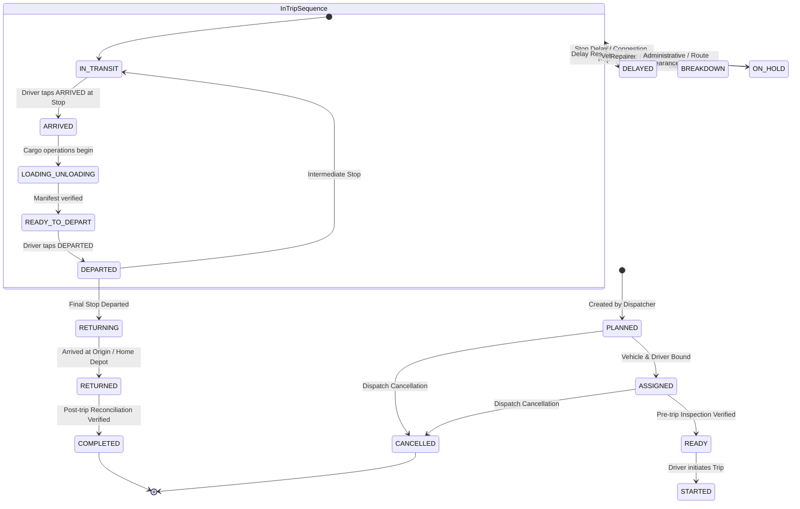

# Trip Lifecycle & State Machine Specification

## 1. Operational State Hierarchy

A Trip in AURELIS FLEET transitions across three distinct layers of state:
1. **Trip Level State** (`trips.status`): Overall mission status.
2. **Stop Level State** (`trip_stops.status`): Progress along individual stops.
3. **Discrete Chronological Events** (`trip_events`): Append-only milestones.

---

## 2. Complete State Machine

---

## 3. Transition Matrix & Rules

| From State | Trigger Action | To State | Initiator | Required Validations & Side Effects |
| :--- | :--- | :--- | :--- | :--- |
| `PLANNED` | `ASSIGN_CREW` | `ASSIGNED` | Manager / Dispatcher | Vehicle must be `AVAILABLE`; Driver must have non-expired license. |
| `ASSIGNED` | `VERIFY_READY` | `READY` | Supervisor / Manager | Pre-trip documentation verified; materials allocated. |
| `READY` | `START_TRIP` | `STARTED` | Driver / Manager | Records `actual_start_time = NOW()`. Updates vehicle to `ON_TRIP`. |
| `STARTED` | `DEPART_ORIGIN` | `IN_TRANSIT` | Driver | Target stop points to Sequence #1. |
| `IN_TRANSIT` | `RECORD_ARRIVAL` | `ARRIVED` | Driver / Supervisor | Records `trip_stops.actual_arrival = NOW()`. Computes `arrival_delay`. |
| `ARRIVED` | `START_CARGO` | `LOADING_UNLOADING` | Driver / Gate Supervisor | Verifies loading / unloading checklist. |
| `LOADING_UNLOADING`| `FINISH_CARGO` | `READY_TO_DEPART` | Driver / Gate Supervisor | Cargo weight reconciliation complete. |
| `READY_TO_DEPART` | `RECORD_DEPARTURE`| `DEPARTED` | Driver | Records `trip_stops.actual_departure = NOW()`. Computes `departure_delay`. |
| `DEPARTED` | `CONTINUE_ROUTE` | `IN_TRANSIT` | System / Driver | If sequence < max sequence, activates sequence + 1. |
| `DEPARTED` | `COMMENCE_RETURN` | `RETURNING` | Driver | Triggered when sequence == max sequence on round-trip. |
| `RETURNING` | `RECORD_RETURN` | `RETURNED` | Driver / Gate Supervisor | Records `actual_return_time = NOW()`. |
| `RETURNED` | `CLOSE_TRIP` | `COMPLETED` | Manager / Supervisor | Finalizes odometer reading, updates vehicle & driver to `AVAILABLE`. |
| Any Active | `REPORT_INCIDENT` | `BREAKDOWN` / `ON_HOLD` | Driver / Manager | Creates row in `incidents`, fires manager operational alerts. |
| Any Active | `MANUAL_OVERRIDE`| (Configured State) | Manager / Admin | Requires mandatory justification text; writes to `audit_logs`. |

---

## 4. Operational Invariants & Integrity Constraints

The backend strictly enforces the following domain rules:

1. **Strict Monotonic Ordering**:
   A driver cannot mark Stop $N$ as `ARRIVED` until Stop $N-1$ has achieved `DEPARTED` (or was marked `SKIPPED` through an audited manager override).
2. **Temporal Consistency**:
   $$\text{actual\_arrival} \le \text{actual\_departure}$$
   A stop cannot depart prior to its arrival timestamp unless an explicit manager correction resolves a clock or data-entry error.
3. **Zero Historical Mutation**:
   When a manager corrects an actual arrival from `10:50` to `10:35`, the original `trip_events` row remains unaltered. A new event of type `MANUAL_CORRECTION` is inserted, the operational table `trip_stops` is updated, and an entry is recorded in `audit_logs`.
4. **License & Fitness Enforcement**:
   No vehicle with expired PUC or insurance may enter `READY`. No driver whose license expires prior to `planned_return_time` can be assigned without a supervisor override flag.

---

## 5. Variance Engine (Planned vs. Actual Delay)

Operational delays are computed immediately as events are logged:

$$\text{Arrival Variance} = \text{Actual Arrival} - \text{Planned Arrival}$$
$$\text{Departure Variance} = \text{Actual Departure} - \text{Planned Departure}$$

If $\text{Arrival Variance} > 0$, the stop is flagged as `DELAYED`, and the driver is prompted on the Android app to categorize the root cause:
- `TRAFFIC` (Congestion, toll plaza delay)
- `LOADING_DELAY` (Crane / dock unavailability)
- `UNLOADING_DELAY` (Customer bay occupied)
- `VEHICLE_PROBLEM` (Overheating, tyre pressure)
- `ROAD_BLOCK` (Construction, landslide)
- `DOCUMENTATION` (Permit check, invoice verification)
- `WEATHER` (Heavy monsoon rain, fog)
